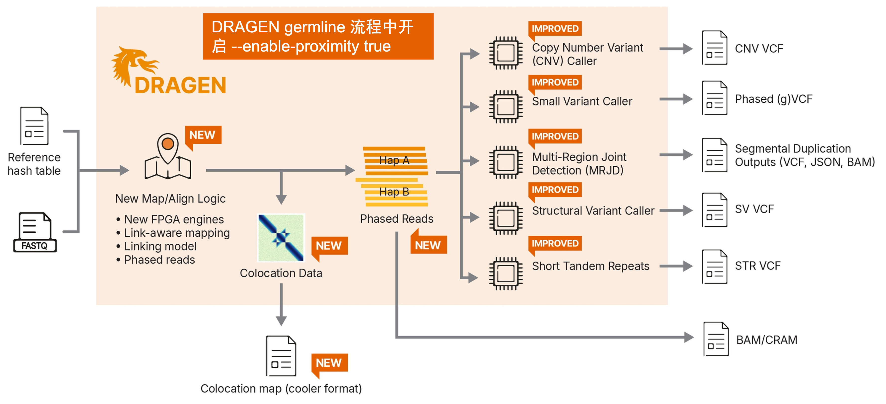
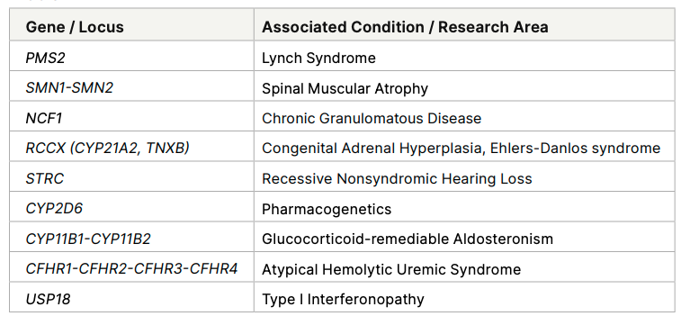
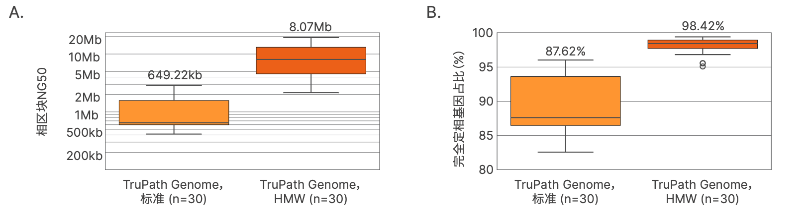

# Illumina TruPath Genome WGS

硬件：dragen sever v4

软件：dragen v4.5+

license:Proximity license（买了试剂盒免费送）

DRAGEN Reports:https://support.illumina.com/sequencing/sequencing_software/dragen-bio-it-platform/product_files.html

2.5-3.5h per WGS

## 名词解释

1. Proximity(临近)

 - Proximity rate：具有临近关系的reads占总reads的比例
 - link quality:基于Phred尺度的质量分数，用于评估两个临近reads来源于同一原始分子模版的概率
 - Link Q25 以上的reads，在全基因组上的平均覆盖度 > 30x (默认值:--proximity-min-linkq-threshold 10 --proximity-additional-linkq-thresholds 25)

2. Multi-Region Joint Detection (MRJD)多区域联合检测，只兼容hg38分析，涉及到15个医学相关的基因(9个医学相关的旁系同源区域进行小变异和拷贝数检测)([15 clinically relevant genes](https://help.dragen.illumina.com/dragen-v4.5/product-guides/dragen-v4.5/dragen-trupath-pipeline#multi-region-joint-detection)).

3. phasing(定相)

Phasing 统计结果文件:NG50 700kb-35Mb

Standard molecular weight DNA （SMW）vs High molecular weight （HMW）

4. colocation协同定位(default size of 200 kb,默认输出文件：colocation.cooler)

 - cooler（https://cooler.readthedocs.io/en/latest/schema.html）可以生成不同解析度的.mcooler
 - HiGlass(https://github.com/higlass/higlass)结果查看

[Illumina TruPath Genome WGS:https://help.dragen.illumina.com/dragen-v4.5/product-guides/dragen-v4.5/dragen-recipes/illumina-trupath-genome-wgs](https://help.dragen.illumina.com/dragen-v4.5/product-guides/dragen-v4.5/dragen-recipes/illumina-trupath-genome-wgs)
      
    /opt/dragen/$VERSION/bin/dragen         #DRAGEN install path 
    --ref-dir $REF_DIR                      #path to DRAGEN pangenome hashtable 
    --output-directory $OUTPUT 
    --intermediate-results-dir $PATH        #e.g. SSD /staging 
    --output-file-prefix $PREFIX 
    # Inputs 
    --fastq-list $PATH                      #see 'Input Options' 
    --fastq-list-sample-id $STRING 
    # Illumina TruPath Genome 
    --enable-proximity true 
    # Mapper 
    --enable-map-align true                 #optional with BAM/CRAM input 
    --enable-map-align-output true          #optionally save the output BAM 
    --enable-sort true                      #default=true 
    --enable-duplicate-marking true         #default=true 
    # Small variant caller 
    --enable-variant-caller true 
    --vc-phasing-min-fragments 0 
    # SV 
    --enable-sv true 
    # CNV 
    --enable-cnv true 
    --cnv-enable-self-normalization true 
    # Targeted caller 
    --enable-targeted true 
    # Short tandem repeats 
    --repeat-genotype-enable true 
    # Multi-Region Joint Detection (MRJD) 
    --enable-mrjd true 

[Illumina TruPath Genome Pipeline:https://help.dragen.illumina.com/dragen-v4.5/product-guides/dragen-v4.5/dragen-trupath-pipeline](https://help.dragen.illumina.com/dragen-v4.5/product-guides/dragen-v4.5/dragen-trupath-pipeline)

[Input recommendations FAQ for the TruPath Genome assay:https://knowledge.illumina.com/library-preparation/general/library-preparation-general-faq-list/000010167](https://knowledge.illumina.com/library-preparation/general/library-preparation-general-faq-list/000010167)

备注：

- 一个样本一条lane,samplesheet需指定lane
- 
[Cheng S, Zhang Q, Zheng X, et al. Constellation illuminates rare disease genetics[J]. medRxiv, 2025: 2025.10. 15.25337675.](https://pmc.ncbi.nlm.nih.gov/articles/PMC12633143/)

