# Illumina TruPath Genome 分析流程（Pipeline）

> **原文来源**：[Illumina TruPath Genome Pipeline](https://help.dragen.illumina.com/dragen-v4.5/product-guides/dragen-v4.5/dragen-trupath-pipeline)（DRAGEN v4.5 产品指南）
> 本文档为上述官方文档的中文翻译，用于学习和参考。

DRAGEN 的 Germline（胚系）分析流程整合了来自 **Illumina TruPath Genome** 建库的邻近（proximity）定位 reads，利用流动槽（flowcell）上编码的长距离信息来增强基因组分析。这种邻近感知（proximity-aware）的工作流程支持高精度的 reads 比对（mapping）、定相（phasing）和变异检测，包括结构变异、旁系同源（paralog）解析的小变异、短串联重复（STR）基因分型以及协同定位（colocation）分析。通过对 reads 间连接概率进行建模和应用，该流程能够使用标准的短读段数据，对复杂和低可比对性（low-mappability）的基因组区域进行更可靠的解读。

## 摘要

- **集成的 TruPath 邻近比对**：启用 `--enable-proximity=true` 即可在整个 DRAGEN Germline 流程中激活邻近感知的建模与分析，使流动槽上空间邻近的 reads 被概率性地关联为来源于同一条 DNA 模板。
- **邻近模型驱动的比对与联配**：DRAGEN 执行一轮初步比对以收集高置信度的联配结果，并拟合一个非线性邻近连接模型，该模型将流动槽空间距离和基因组距离与 reads 间连接概率关联起来。生成的 Phred 尺度连接概率查找表在 map/align 阶段用于解决模糊比对，提高重复区域和复杂基因组区域中的 reads 定位准确度。
- **增强的定相支持**：邻近信息通过将来自同一原始模板分子的 reads 关联起来，加强了 reads 定相，从而实现更长、更可靠的定相区块（phasing blocks），并传递到变异检测和基于组装的后续分析中。
- **结构变异检测**：Germline SV 检测器利用邻近衍生的定相信息，为单样本 TruPath 全基因组分析提供分相组装（phased assemblies）、单倍型感知的机器学习特征和单倍型解析的基因分型。
- **旁系同源区域中的单倍型解析小变异检测**：对于临床相关的旁系同源区域，多区域联合检测（MRJD）根据 read 深度估算总拷贝数，利用 read 序列和邻近信息重建各个旁系同源拷贝，将每个拷贝分配到特定的基因组区域或单倍型，并从重建的拷贝中检出小变异。
- **支持 IRR 回收的 STR 基因分型**：邻近连接能够回收并定位原本无法比对的重复区内 reads（in-repeat reads, IRRs），改进大片段 STR 扩张的检测与大小评估，并支持定相感知的基因分型。
- **协同定位分析与过滤**：协同定位图谱（Colocation maps）利用邻近连接的 reads 汇总长距离基因组互作，用于可视化结构特征并过滤缺乏邻近支持的 SV 断点（breakends）。
- **专门的输出与报告**：该流程生成邻近感知的 BAM/CRAM 文件、VCF 文件、JSON 摘要、cooler 文件，以及带有专门 QC 指标与可视化的 TruPath 专属 DRAGEN 报告。

## 概述

短读段 DNA 测序通常能以较高准确度捕获基因组变异，但缺乏解决重复、旁系同源和结构变异等复杂区域所需的长距离背景信息。**Illumina TruPath Genome 建库**通过保留来自同一条原始 DNA 分子的 reads 之间的空间邻近性，将长距离分子信息直接编码在流动槽上。当与 DRAGEN 的邻近感知算法结合时，这一信息能够实现超越标准短读段数据能力的的长距离分析。

**针对 Illumina TruPath Genome 的 DRAGEN Germline 分析流程**通过一个概率性邻近连接模型利用流动槽上编码的邻近信息，该模型根据空间和基因组距离为 reads 间连接分配概率。当启用邻近模式时，DRAGEN 自动拟合该模型，生成 Phred 尺度的邻近连接概率分布，并将其应用于比对、定相和变异检测等整个工作流程。这些邻近连接概率作为贯穿整个流程的基础信号被反复使用——为联配打分、定相区块、候选组装、机器学习特征和变异过滤提供信息——以提高重复性和结构复杂基因组区域的准确度与置信度，同时保持与标准短读段测序工作流程和文件格式的兼容性。

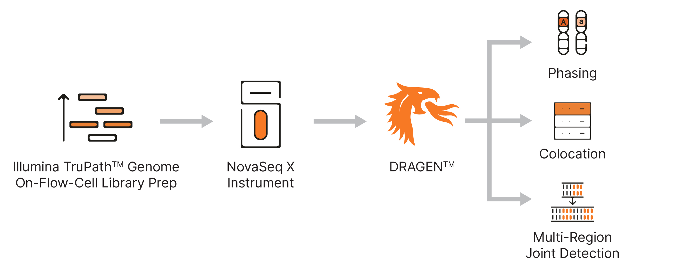

## DRAGEN 中的邻近模式分析

当启用邻近模式时，DRAGEN 会自动执行额外的建模和下游分析，在整个 Germline 流程中整合邻近信息。通过在 DRAGEN Germline 运行时设置 `--enable-proximity=true` 即可激活 TruPath 专属的邻近分析。这种邻近感知的处理支持以下工作流程和功能：

- 使用连接感知的联配打分进行高精度 read 比对
- 通过 read 到模板（template）的关联增强定相
- 使用分相组装和单倍型感知算法进行结构变异检测
- 使用多区域联合检测（MRJD）进行旁系同源解析的小变异检测
- 通过重复区内 reads（IRR）回收改进 STR 基因分型
- 使用协同定位图谱进行长距离基因组互作分析和 SV 过滤

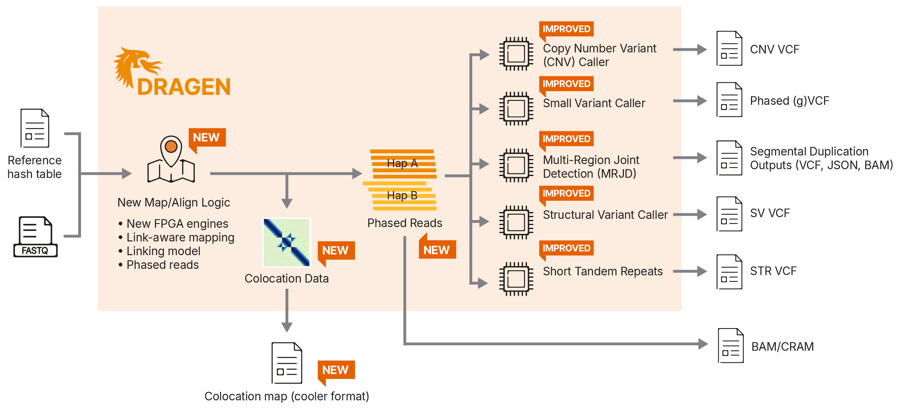

## TruPath Genome 与标准 Illumina SBS 相比的主要优势

当为 TruPath Genome 数据启用带邻近模式的 DRAGEN Germline 时，相对于标准 Illumina SBS 输入，在多个性能维度上均可观察到改进。

这些改进包括：小变异检测准确度提升、定相区块更长、完全定相的基因比例更高，以及结构变异召回率提升。下表总结了 TruPath 与标准 Illumina SBS 数据集的关键性能指标。

| 优势 | TruPath，高分子量输入 DNA | TruPath，标准分子量输入 DNA | DRAGEN 4.4 上的标准 Illumina SBS |
| --- | --- | --- | --- |
| **同类最佳的小变异检测性能** | 36,717 FP+FN | 40,267 FP+FN | 61,288 |
| **多兆碱基定相区块** | 8.1 Mbp | 649 kbp | 不适用 |
| **完全定相的基因** | 98.4% | 87.6% | 0% |
| **改进的 SV 召回率** | 94.0% | 93.7% | 80.7% |

### 临床相关基因家族中定相的高质量小变异检测

TruPath 邻近感知分析利用[多区域联合检测（MRJD）](#多区域联合检测-mrjd)，在十个临床相关的旁系同源基因家族中实现了单倍型解析、拷贝数感知的小变异检测，如下表所示。使用 TruPath 数据时，MRJD 无需依赖群体单倍型即可在这些受支持的旁系同源区域中产生定相的变异检测结果。

#### 受支持的基因

| 旁系同源基因 | 疾病相关性 |
| --- | --- |
| **PMS2** | 林奇综合征（Lynch Syndrome） |
| **SMN1–SMN2** | 脊髓性肌萎缩症（Spinal Muscular Atrophy） |
| **NCF1** | 慢性肉芽肿病（Chronic Granulomatous Disease） |
| **CYP21A2** | 先天性肾上腺增生（Congenital Adrenal Hyperplasia） |
| **TNXB** | 埃勒斯-当洛综合征（Ehlers–Danlos syndrome） |
| **STRC** | 隐性非综合征性听力损失（Recessive Nonsyndromic Hearing Loss） |
| **CYP2D6** | 药物基因组学（Pharmacogenetics） |
| **CYP11B1–CYP11B2** | 糖皮质激素可纠正性醛固酮增多症（Glucocorticoid-remediable Aldosteronism） |
| **CFHR1–CFHR2–CFHR3–CFHR4** | 非典型溶血性尿毒症综合征（Atypical Hemolytic Uremic Syndrome） |
| **USP18** | I 型干扰素病（Type I Interferonopathy） |

下图展示了 MRJD 为 *PMS2* 和 *PMS2CL* 生成的单倍型解析变异检测结果，每个位点作为独立拷贝分别报告，并与长读段数据进行了对比。

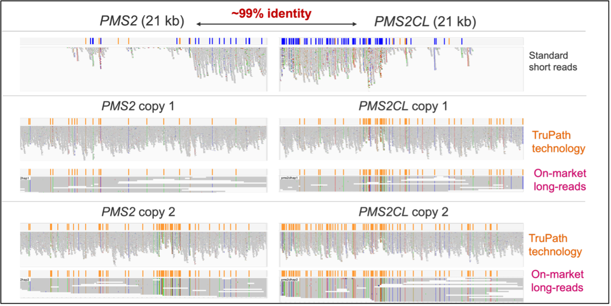

### 改进的 STR 扩张长度与分类准确度

TruPath 分析通过回收完全由 STR 序列组成的片段，并应用测序效率校正来补偿位点特异的覆盖度偏差，从而改进了短串联重复（STR）扩张长度的估算。

这些改进使 STR 长度估算更贴近预期的重复大小，并支持更准确的扩张分类。下图对比了在多个位点上使用标准 Illumina 测序和 TruPath 分析生成的 STR 扩张长度估算。

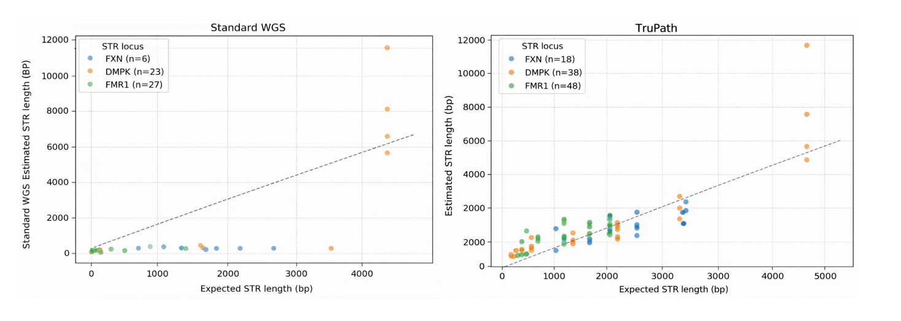

### 改进的 BND 过滤

TruPath 邻近信息能够对 DRAGEN 结构变异（SV）检测产生的大型（>200 kbp）染色体内和染色体间断点（breakend, BND）检测结果进行更具选择性的过滤。

纳入协同定位证据后，在保持召回率的同时减少了报告的大型 BND 事件数量。这一效果在评估样本中对于染色体内和染色体间 BND 均可观察到。

下表汇总了 TruPath Coriell 样本（n=45）在启用与不启用协同定位过滤时，报告的染色体内和染色体间 BND 检测结果的召回率与减少情况。

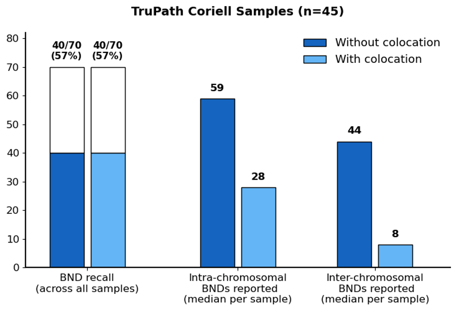

## 邻近连接模型

在 Illumina TruPath Genome 数据中，流动槽上邻近的 read 对更有可能来源于同一条原始模板分子。为了量化这一可能性，DRAGEN 使用概率性邻近连接模型，将基因组距离和流动槽邻近性与两条 reads 来源于同一条输入 DNA 分子的概率关联起来。

当使用 `--enable-proximity=true` 运行 DRAGEN 时，比对器（mapper）会估算该邻近连接模型的参数，并为每个 TruPath FASTQ 输入生成连接概率分布。这一过程包括三个阶段：样本收集（sample collection）、邻近分析（proximity analysis）和模型拟合（model fitting），随后生成连接概率查找表。

### 样本收集

为了拟合邻近连接模型，DRAGEN 首先从输入数据中收集具有代表性的初步联配子集。在初始比对阶段，联配结果按流动槽 tile 大小的批次生成，满足适用性要求的 reads 会被保留用于邻近分析。

合格的初步联配必须满足以下条件：

- 比对 MAPQ ≥ 60
- 主要（primary）联配
- 非重复（non-duplicate）reads
- 对于双端（paired-end）数据，需为 read 对中的第一条（first-in-pair），且 mate 已比对并正确配对

DRAGEN 会持续采样，直到收集到 100 万个合格的初步联配，或整个 FASTQ 输入处理完毕。如果收集到的联配少于 100 万个，处理将继续进行，但会发出警告提示样本可能不足。如果未找到合适的联配，DRAGEN 将以错误退出。

### 邻近分析

一旦收集到足够的初步联配集合，DRAGEN 会分析在流动槽上空间邻近且与参考基因组上基因组邻近的 read 对。同时满足两个条件的 read 对极有可能来源于同一条模板分子。

每条联配都与一个比对的基因组位置和一个流动槽坐标（X, Y）相关联。对于候选 read 对，DRAGEN 会计算：

- 流动槽上的空间位移，表示为（`XD`, `YD`），单位为纳米（nm）
- 基因组位移，表示为 `GDIST`，单位为碱基对（bp），并取整到最近的 1,000 bp

空间和基因组位移均落在配置的邻近阈值内的 read 对被认为是可能连接的。对于这些 read 对，统计量会跨 `XD`、`YD` 和 `GDIST` 的组合进行汇总。这些汇总计数构成模型拟合阶段的经验输入。

同时，还会使用空间上邻近但基因组上距离较远的 read 对收集第二组计数。这些 read 对被认为代表随机巧合的协同定位（chance colocation），用于对背景噪声进行建模。

在继续之前，DRAGEN 会评估两组计数，以确保观察到的趋势与 TruPath 数据一致。如果数据未通过验证，DRAGEN 将以错误退出。

### 模型拟合

邻近连接模型是非线性的，包含大约 20 个参数，用于预测作为 `XD`、`YD` 和 `GDIST` 函数的预期连接 read 对数（`N`）。邻近分析得到的汇总计数被提交给非线性最小二乘求解器来估算这些参数。

如果求解器无法收敛，DRAGEN 将以错误退出。当拟合成功时，该模型能够计算预期的连接 read 对数 μ(XD, YD, GDIST)，相对于经验计数提供一个平滑的估计值。

一个独立的背景模型估算由于偶然因素导致的预期邻近 read 对数 μ_chance(XD, YD, GDIST)。连接概率按如下方式计算：

$$1 - \frac{\mu_{\text{chance}}(\text{XD}, \text{YD}, \text{GDIST})}{\mu(\text{XD}, \text{YD}, \text{GDIST})}$$

该概率通常以 Phred 尺度表示：

$$-10 \log_{10} \left(\frac{\mu_{\text{chance}}(\text{XD}, \text{YD}, \text{GDIST})}{\mu(\text{XD}, \text{YD}, \text{GDIST})}\right)$$

数值越高，表示两条 reads 来源于同一条模板分子的可能性越强。

### 连接概率分布生成

模型拟合成功后，DRAGEN 会在空间和基因组位移的实际范围内评估拟合模型，并将生成的连接概率存储在查找表中。该表会持续生成，直到连接概率低于最小阈值。

这个查找表是 TruPath 邻近连接模型的主要输出，DRAGEN Germline 流程在比对、模板标记（template tagging）和变异检测过程中使用它来纳入邻近信息。

在少数情况下，如果拟合模型未能产生高于最小阈值的有意义的连接概率，则会生成一个空的查找表，并且 DRAGEN 以错误退出。

## Map/Align（比对/联配）

邻近连接模型在比对阶段用于提高 TruPath 样本的 read 联配准确度。在高序列同源性的区域中，标准 Illumina 测序 reads 可能以相同或几乎相同的得分联配到多个基因组位置，从而导致模糊比对。使用 TruPath 数据时，邻近连接的 read 对可以提供额外的背景信息，使 read 对中的两条 reads 都能被唯一比对。

来源于流动槽上某个感兴趣区域的 read 对会通过标准的比对工作流程进行处理。系统会生成并评估多个候选联配，关键属性（包括联配得分、基因组位置和流动槽位置）会存储在一个索引化的数据结构中。

对于每个可能受益于邻近信息的 read 对 `X`，比对器会重新检查候选联配，并在数据结构中搜索其他 read 对 `Y`，这些 read 对的联配位置和流动槽位置暗示它们共享同一个模板来源。邻近连接模型量化了 `X` 和 `Y` 来源于同一条原始 DNA 分子的可能性。由此可能性衍生的 Phred 尺度得分会被纳入相应的联合联配假设中。

## 模板标记（Template Tagging）

在联配过程中，比对器为每条 read 分配一组连接概率得分，用于估算该 read 与流动槽上其他邻近 reads 之间连接的可能性。模板标记利用这些得分重建双端 reads 所来源的原始模板 DNA 分子。

模板标记首先将 reads 分组为片段（fragments），每个片段由一个双端 read 对组成。对于每个片段，从其组成 reads 中收集外向的连接概率得分。Phred 尺度质量低于 `--proximity-min-linkq-threshold`（默认值：10）所指定阈值的连接会被丢弃。

剩余的高质量连接用于将片段连接成模板（templates）。每个连接的片段集合代表一个重建的模板分子。分配给同一模板的所有 reads 都会在 BAM 文件中标注一个共享的模板标识符（`BX:Z`），以便下游识别来源于同一条原始 DNA 分子的 reads。

### 输出

模板标记会生成一组指标报告，描述在 DRAGEN 运行期间发现的所有模板和连接的特征。报告针对全基因组数据以及任何指定的 QC 区域生成。

如果模板或连接的基因组跨度与 QC 区域有任意部分重叠，则该模板或连接会包含在 QC 区域指标中。

#### 模板指标

**模板子对计数报告**

模板子对计数报告 `<prefix>.<qc-region>_template_subpairs.csv` 按所包含的片段（子对）数量汇总已发现模板的分布。*子对（subpair）* 指模板内的一个 read 对片段。

报告中的每条记录描述具有给定片段数量的模板数量，以及占所有模板的百分比。同时还会报告汇总统计信息，包括子对计数的平均值和选定的百分位数。示例汇总统计包括平均子对计数，以及跨所有模板的第 25、50、75 和 95 百分位子对计数。

**模板基因组距离报告**

模板基因组距离报告 `<prefix>.<qc-region>_template_gdist.csv` 描述模板基因组长度从第 0 到第 100 百分位的分布。

模板基因组长度定义为模板中所代表的最小和最大比对基因组位置之间的基因组距离，对应于从第一个片段的起点到最后一个片段终点的跨度。

百分位数值是从所有已发现模板长度的分布中插值得到的，因此可能是非整数的碱基对数值。

**模板空间距离报告**

模板空间距离报告描述模板空间范围从第 0 到第 100 百分位的分布，单位为流动槽单位（FCU）。共生成两份报告：

- `<prefix>.<qc-region>_template_xdist.csv`，描述沿流动槽 X 轴的空间范围
- `<prefix>.<qc-region>_template_ydist.csv`，描述沿流动槽 Y 轴的空间范围

模板空间长度定义为模板沿相应轴所代表的最小和最大流动槽坐标之间的距离。与基因组距离一样，百分位数值从观察到的分布中插值得到，可能是非整数的 FCU 值。

**模板长度阈值报告**

模板长度阈值报告 `<prefix>.<qc-region>_template_thresholds.csv` 汇总基因组长度超过指定阈值的已发现模板的数量和比例。

模板基因组长度定义为模板内最小和最大比对基因组位置之间的跨度。

该文件中报告的阈值通过 `--template-gdist-thresholds` 选项定义（默认值：10000, 20000, 60000）。每条记录报告阈值数值、达到或超过该阈值的模板数量，以及占所有已发现模板的相应比例。

#### 连接指标

连接指标针对运行时指定的每个 Phred 尺度连接质量阈值生成。这些阈值控制计算邻近指标时考虑哪些连接。

以下选项决定连接指标的生成：

- `--proximity-min-linkq-threshold`
  - 指定模板标记期间用于接受或拒绝连接假设的主要连接质量阈值（默认值：10）。
- `--proximity-additional-linkq-thresholds`
  - 指定计算连接指标时的最多两个额外连接质量阈值（默认值：25）。

**连接基因组距离报告**

连接基因组距离报告 `<prefix>.<qc-region>_proximity_gdist.csv` 描述达到或超过指定连接质量阈值的连接的基因组距离分布。

连接基因组长度定义为由该连接相连的两个片段之间的基因组距离。距离按第 0 到第 100 百分位报告。

百分位数值是从所有已发现连接长度的分布中插值得到的，因此可能是非整数的碱基对数值。

**连接空间距离报告**

连接空间距离报告描述连接在流动槽单位（FCU）中的空间范围，从第 0 到第 100 百分位。每个连接质量阈值都会生成两份报告：

- `<prefix>.<qc-region>_proximity_xdist.csv`，报告沿流动槽 X 轴的空间范围
- `<prefix>.<qc-region>_proximity_ydist.csv`，报告沿流动槽 Y 轴的空间范围

连接空间长度定义为沿相应轴由该连接相连的两个片段的流动槽坐标之间的距离。

与基因组距离指标一样，百分位数值从观察到的分布中插值得到，可能是非整数的流动槽单位数值。

## 定相（Phasing）

使用 TruPath 数据时，DRAGEN 在变异检测之前执行 read 定相，并使用单倍型定相的 reads 生成定相的变异检测结果。定相同时受到 TruPath 建库提供的长距离邻近连接信息以及样本祖先单倍型推断的指导，从而能够在长基因组距离上实现稳健的定相。

DRAGEN 个性化（personalization）通过推断样本的祖先单倍型提供定相信息的祖先组分，使得定相结果通常被推断为与祖先单倍型中观察到的一致。与标准的个性化工作流程一样，DRAGEN 还使用从单倍型数据库中插补的变异来为样本中的变异提供先验概率，从而提升变异检测性能。

### 定相模型概述

DRAGEN 在小的连续基因组 bin 层面进行定相，通常长度为 4,096 bp。在每个 bin 内，使用参考哈希表中的单倍型数据库推断单倍型，并据此分配 reads。邻近连接信息用于跨 bin 传播定相信息。

当存在足够的共定相证据时，bin 会被分组为更大的、互不重叠的定相区块（phase blocks）。每个 bin 都在邻近 bin 以及基因组其他地方连接 reads 推断出的祖先单倍型背景下进行定相。

请注意，定相方法假设所有常染色体位点都是二倍体，因此在非二倍体区域中，read 和变异定相结果可能不可靠。

### 定相选项

当使用 `--enable-proximity=true` 启用邻近模式时，定相会自动启用。无需额外参数。推荐使用默认设置，但可以通过以下选项调整定相行为：

- `--personalization-phase-block-threshold`
  - 控制将相邻 bin 分组成单个定相区块所需的证据量（默认值：20）。
- `--read-phasing-gene-list`
  - 指定一个可选的 GTF 文件，用于计算完全包含在定相区块内的基因的基于基因的定相指标。

降低定相区块阈值参数会减少将相邻个性化 bin 分组成单个定相区块所需的共定相证据量，反之亦然。

### 输出文件

#### BAM/CRAM 输出

map/align 输出文件中定相的 reads 带有以下标签：

| 标签 | 描述 | 取值 |
| --- | --- | --- |
| `pp` | 定相概率，Phred 尺度对数几率：$$10 \times \log_{10}(P(H_1) / P(H_2))$$ | $$[-127, 127]$$ |
| `HP` | 所有满足 $$\lvert pp \rvert \geq 10$$ 的 reads 的单倍型标签 | $$1, 2$$ |
| `PS` | 定相区块标签 | $$[0, 2^{32})$$ |

#### 个性化单倍型

每个定相 bin 的个性化单倍型以制表符分隔（TSV）格式输出。TSV 文件中定义的定相区块摘要也会以 GTF 格式输出。

#### TSV（`<sample_id>.personal_haplotypes.tsv.gz`）

个性化单倍型 TSV 文件包含以下列：

| 列名 | 描述 |
| --- | --- |
| `CHROM` | 染色体名称 |
| `START` | 定相 bin 的起始位置（0-based） |
| `END` | 定相 bin 的结束位置（1-based） |
| `PHASE_BLOCK` | bin 的定相区块 ID。具有相同 ID 的 bin 被可靠地共定相。 |
| `PHASING_CONFIDENCE` | bin 的定相置信度。较低的置信度值表示单倍型切换的可能性较高。 |

#### GTF（`<sample_id>.phase_blocks.gtf.gz`）

个性化 TSV 文件 `PHASE_BLOCK` 列中定义的定相区块所覆盖的区域也会以 GTF 文件输出，字段如下：

| 列名 | 描述 |
| --- | --- |
| `seqname` | 染色体名称 |
| `source` | 恒为 'dragen' |
| `feature` | 恒为 'phaseblock' |
| `start` | 定相区块的起始位置（1-based） |
| `end` | 定相区块的结束位置（1-based） |
| `score` | 未使用（'.'） |
| `strand` | 未使用（'.'） |
| `frame` | 未使用（'.'） |
| `attribute` | 恒为 'phase_block n' |

#### 插补变异

每个定相 bin 的插补变异以 VCF 文件输出。该 VCF 仅包含从参考哈希表中的单倍型数据库插补的变异。它不包含样本中观察到的新变异，多等位基因变异会被拆分为独立的记录。

#### VCF（`<sample_id>.personal.vcf.gz`）

该 VCF 遵循 4.2 标准，以下是相关字段的描述：

| 标签 | 描述 |
| --- | --- |
| `QUAL` | ALT 边缘概率的 Phred 尺度得分。例如，对于二倍体变异：$$-10 \times \log_{10}(P(\text{GT='0'}\vert\text{0'}))$$ |
| `INFO:HAPS` | 变异所属 bin 的两个最佳单倍型对 |
| `INFO:PGP` | $$P(\text{GT='0'}\vert\text{0'}), P(\text{GT='1'}\vert\text{0'}) + P(\text{GT='0'}\vert\text{1'}), P(\text{GT='1'}\vert\text{1'})$$ 的边缘概率 |
| `FORMAT:PS` | 变异所属 bin 的定相区块 ID |

#### 定相指标

DRAGEN 为每次 TruPath 分析报告一组定相指标，并写入摘要 CSV 文件。报告的指标包括定相区块长度统计（`N50`、`L50`、`NG50`、`LG50`）、累积定相区块长度、完全定相的基因组窗口数量以及完全定相的基因数量。仅当使用 `--read-phasing-gene-list` 提供基因列表时，才会报告基于基因的指标。

#### CSV（`<sample_id>.phasing_summary_stats.csv`）

| 指标 | 描述 |
| --- | --- |
| `Phasing chromosomes` | 用于计算指标的染色体列表。仅考虑具有定相 reads 的常染色体。 |
| `N50` | 最短定相区块的长度，其中所有至少该长度的定相区块合计占累积定相区块长度的 ≥50%。 |
| `L50` | 占累积定相区块长度 50% 的最小定相区块数量。 |
| `NG50` | 最短定相区块的长度，其中所有至少该长度的定相区块合计占定相染色体集合累积长度的 ≥50%。 |
| `LG50` | 占定相染色体集合累积长度 50% 的最小定相区块数量。 |
| `Total phase block length for L50/N50` | 定相区块组装的累积长度。 |
| `Total phase block length for LG50/NG50` | 染色体集合的累积长度。 |
| `Number of fully phased 300 kbp windows` | 将每条染色体划分为 300 kbp 窗口后，完全包含在单个定相区块内的此类窗口数量。 |
| `Number of fully phased genes` | 完全包含在单个定相区块内的基因数量。 |
| `Gene list` | 用于计算完全定相基因数量的基因列表文件名 |

## 结构变异检测

TruPath 专属的结构变异（SV）检测仅在单样本全基因组胚系 SV 发现模式下受支持。DRAGEN-SV 通过 reads 中编码的定相信息间接利用邻近信息，而不是在 SV 检测期间直接使用邻近连接。

这种方法提供了几个关键优势。候选区域按单倍型分别组装，这降低了组装图复杂度并产生更高质量的 contigs。机器学习（ML）模型使用的特征也按单倍型分离，从而改进训练和推断。因此，杂合 SV 可以被区分并分配到特定的局部单倍型。

### 利用 TruPath 邻近连接特征

DRAGEN-SV 目前通过在候选组装和基于 ML 的过滤期间使用定相信息来间接纳入邻近信息。为了获得最佳准确度，应保持启用 ML 过滤。

#### 分相组装

为候选组装收集的 reads 根据可用的定相信息被划分为两个单倍型。每个单倍型独立组装，每个单倍型最多产生一个 contig。每个候选最多两个 contigs 会传递到流程的下游阶段。

#### ML 处理

当使用 TruPath 数据运行时，DRAGEN-SV 使用在 TruPath 衍生特征上训练的 ML 模型，这些特征依赖于 read 级别的定相，此外还使用与标准 Illumina 测序数据一起使用的特征。启用 ML 处理对于实现最佳 SV 检测准确度至关重要。

#### 合并、去重、重新基因分型

某些类型的结构变异（包括插入和缺失）可能从多轮分相组装中产生。当这些 SV 被推断为代表同一事件时，会在写入 VCF 输出之前被合并和去重。SV 类型、长度、基因组位置、基因型得分和来源单倍型用于确定等价性。

在此过程中，基因型可能会被更新。例如，如果杂合 SV 仅由定相到第一个单倍型的 reads 产生，则 `GT` 字段设置为 `1/0`。如果来自不同单倍型的两个 SV 被合并为单个事件，则生成的 SV 会被重新基因分型为 `1/1`。

### SV VCF 输出

以下 VCF 字段是为 TruPath 新增的：

**INFO 字段**

| ID | 描述 |
| --- | --- |
| `PHASEDASM` | 用于产生 SV 的组装的 reads 的单倍型（仅当 `--enable-proximity=true` 时） |
| `ML_UPDATED` | QUAL 被 ML 重新校准后，FILTER 状态从 PASS 变为非 PASS，或从非 PASS 变为 PASS |

**FORMAT 字段**

| ID | 描述 |
| --- | --- |
| `MLQS` | 插入缺失（indel）的 ML 重新校准 QUAL |

**FILTER 字段**

| ID | 级别 | 描述 |
| --- | --- | --- |
| `MLFail` | 记录 | 对于缺失（deletion），Prob(TP) 小于 SV_ML_MIN_PASS_DEL_PROB；对于插入（insertion），Prob(TP) 小于 SV_ML_MIN_PASS_INS_PROB（[默认值](#默认值)） |

## 多区域联合检测（MRJD）

DRAGEN 多区域联合检测（MRJD）是用于旁系同源区域的胚系小变异检测器。当与 TruPath 数据一起使用时，MRJD 通过利用 TruPath 启用的邻近连接信息产生单倍型解析的变异检测结果。这种方法不依赖已知的群体单倍型。

使用 TruPath 数据时，MRJD 目前支持九组旁系同源区域，涵盖 15 个临床相关基因。表 1 列出了 MRJD 覆盖的 hg38 基因组坐标。MRJD 仅兼容 **hg38** 参考基因组。

| 染色体 | 起始 | 结束 | 区域名称 | 旁系同源组名称 | 旁系同源类型 |
| --- | --- | --- | --- | --- | --- |
| chr1 | 196786972 | 196827189 | CFHR3-CFHR1 | CFHR3-CFHR1-CFHR4-CFHR2 | 非串联（Non-tandem） |
| chr1 | 196911497 | 196951222 | CFHR4-CFHR2 | CFHR3-CFHR1-CFHR4-CFHR2 | 非串联（Non-tandem） |
| chr5 | 70924941 | 70966375 | SMN1 | SMN1-SMN2 | 非串联（Non-tandem） |
| chr5 | 70049523 | 70090528 | SMN2 | SMN1-SMN2 | 非串联（Non-tandem） |
| chr6 | 32037415 | 32045473 | CYP21A2-TNXB | CYP21A2 | 串联（Tandem） |
| chr6 | 32004679 | 32012619 | CYP21A1P-TNXA | CYP21A2 | 串联（Tandem） |
| chr7 | 5969485 | 5987844 | PMS2 | PMS2-PMS2CL | 非串联（Non-tandem） |
| chr7 | 6736851 | 6755308 | PMS2CL | PMS2-PMS2CL | 非串联（Non-tandem） |
| chr7 | 74771000 | 74791999 | NCF1 | NCF1-NCF1B-NCF1C | 非串联（Non-tandem） |
| chr7 | 73217606 | 73238630 | NCF1B | NCF1-NCF1B-NCF1C | 非串联（Non-tandem） |
| chr7 | 75153934 | 75174978 | NCF1C | NCF1-NCF1B-NCF1C | 非串联（Non-tandem） |
| chr8 | 142873164 | 142879856 | CYP11B1 | CYP11B1-CYP11B2 | 串联（Tandem） |
| chr8 | 142910764 | 142917883 | CYP11B2 | CYP11B1-CYP11B2 | 串联（Tandem） |
| chr15 | 43599563 | 43618800 | STRC | STRC-STRCP1 | 串联（Tandem） |
| chr15 | 43699418 | 43718260 | STRCP1 | STRC-STRCP1 | 串联（Tandem） |
| chr22 | 18159724 | 18174315 | USP18 | USP18-USP41P | 非串联（Non-tandem） |
| chr22 | 20362649 | 20377695 | USP41P | USP18-USP41P | 非串联（Non-tandem） |
| chr22 | 42123192 | 42132193 | CYP2D6 | CYP2D6-CYP2D7 | 串联（Tandem） |
| chr22 | 42135344 | 42145873 | CYP2D7 | CYP2D6-CYP2D7 | 串联（Tandem） |

表 1. MRJD 覆盖的旁系同源区域。

### 方法

MRJD 首先收集感兴趣旁系同源区域内所有主要联配，无论比对质量如何。对于每组旁系同源区域（例如 *SMN1–SMN2*），MRJD 通过利用感兴趣区域的 read 深度以及基因组其他位置预先选择的稳定区域，估算总拷贝数。

利用估算的总拷贝数、read 序列和邻近连接信息，MRJD 为每组旁系同源区域构建相应数量的拷贝。对于非串联旁系同源区域，邻近信息用于将每个构建的拷贝分配到其最可能来源的基因组区域（例如 *PMS2* 对比 *PMS2CL*）。对于串联旁系同源区域，邻近信息则用于将每个拷贝分配到母源或父源单倍型。

最后，MRJD 基于构建的拷贝检出小变异，并连同其分配的基因组区域或单倍型一起报告变异检测结果。

下图提供了使用 TruPath 数据的 MRJD 工作流程概览。

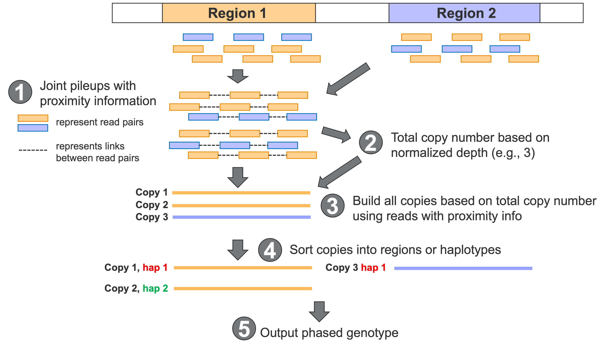

### 输出

分析完成后，DRAGEN 在 `--output-directory` 指定的目录中生成以下 MRJD 输出文件，并使用 `--output-file-prefix` 定义的前缀：

- `<prefix>.mrjd.hard-filtered.vcf.gz`
  - 包含 MRJD 在旁系同源区域检出的小变异的 VCF 文件。
- `<prefix>.mrjd.json`
  - 包含 MRJD 结果的 JSON 文件，包括拷贝数估算、每个拷贝的区域或单倍型分配，以及每个旁系同源区域的运行状态。
- `<prefix>.mrjd.phased.bam`
  - 包含旁系同源区域内定相 read 联配的 BAM 文件。
- `mrjd_supporting_files/`
  - 包含支持 MRJD 可视化的附加文件的目录，包括：
    - `<prefix>.mrjd.<paralog_name>.vcf.gz`
      - 包含每个旁系同源区域 MRJD 变异检测结果的多列 VCF 文件（每个拷贝一列）。每组旁系同源区域生成一个文件。
    - `<prefix>.mrjd.reference_region_alignments.sam`
      - 包含 MRJD 使用的参考区域联配的 SAM 文件。

#### MRJD VCF 输出

MRJD 检测器生成一个 gzip 压缩的 VCFv4.2 文件 `<prefix>.mrjd.hard-filtered.vcf.gz`，包含从推断基因型得到的小变异。

对于给定的一组旁系同源区域，所有拷贝都在每个区域下报告。每个拷贝根据旁系同源结构，在 FORMAT 字段中标注其分配的基因组区域或单倍型。

对于非串联旁系同源区域，`FORMAT` 列中的 `REGION_PLACEMENT` 字段指示每个拷贝的基因组区域分配，其顺序遵循基因型字段中条目的顺序。取值表示分配到当前区域、分配到替代区域，或未放置的拷贝。

| #CHROM | POS | ID | REF | ALT | QUAL | FILTER | INFO | FORMAT | \<prefix\> |
| --- | --- | --- | --- | --- | --- | --- | --- | --- | --- |
| chr5 | 70052190 | . | C | CA | 500 | . | regionGroupName=SMN1-SMN2;REF_DIFF_SITE | GT:REGION_PLACEMENT:RPQL:PQ:JAD:JAF:JDP:PS | 1\|0\|0\|0:A,A,I,I:.:500:90,30:0.250:120:70052190 |
| chr5 | 70052613 | . | T | C | 500 | . | regionGroupName=SMN1-SMN2 | GT:REGION_PLACEMENT:RPQL:PQ:JAD:JAF:JDP:PS | 1\|0\|0\|0:A,A,I,I:.:500:86,35:0.289:121:70052190 |
| chr5 | 70052881 | . | C | CAAAAA | 500 | . | regionGroupName=SMN1-SMN2;REF_DIFF_SITE | GT:REGION_PLACEMENT:RPQL:PQ:JAD:JAF:JDP:PS | 1\|0\|0\|0:A,A,I,I:.:500:93,28:0.231:121:70052190 |
| chr5 | 70053733 | . | TC | T | 500 | . | regionGroupName=SMN1-SMN2 | GT:REGION_PLACEMENT:RPQL:PQ:JAD:JAF:JDP:PS | 0\|1\|0\|0:A,A,I,I:.:500:85,32:0.274:117:70052190 |
| chr5 | 70053985 | . | CT | C | 500 | . | regionGroupName=SMN1-SMN2 | GT:REGION_PLACEMENT:RPQL:PQ:JAD:JAF:JDP:PS | 0\|1\|0\|1:A,A,I,I:.:500:67,65:0.492:132:70052190 |
| chr5 | 70054456 | . | TA | T | 500 | . | regionGroupName=SMN1-SMN2 | GT:REGION_PLACEMENT:RPQL:PQ:JAD:JAF:JDP:PS | 0\|1\|1\|1:A,A,I,I:.:500:22,105:0.827:127:70052190 |

对于串联旁系同源区域，`FORMAT` 列中的 `PSL` 字段指示每个拷贝的单倍型分配，同样遵循基因型字段中条目的顺序。`hap1` 和 `hap2` 分别对应分配到第一个和第二个单倍型。由于串联拷贝无法分配到特定的基因组区域，`REGION_PLACEMENT` 字段不适用，所有拷贝均填充为 `U`（unplaced，未放置）。

| #CHROM | POS | ID | REF | ALT | QUAL | FILTER | INFO | FORMAT | \<prefix\> |
| --- | --- | --- | --- | --- | --- | --- | --- | --- | --- |
| chr6 | 32004754 | . | T | C | 63.01 | . | regionGroupName=CYP21A2;REF_DIFF_SITE | GT:PSL:REGION_PLACEMENT:AGQL:PQ:JAD:JAF:JDP:PS | 1\|0\|1\|0:copy1_hap1,copy2_hap1,copy3_hap2,copy4_hap2:U,U,U,U:0.78:1:57,54:0.486:111:32004754 |
| chr6 | 32004791 | . | G | A | 63.01 | . | regionGroupName=CYP21A2;REF_DIFF_SITE | GT:PSL:REGION_PLACEMENT:AGQL:PQ:JAD:JAF:JDP:PS | 1\|0\|1\|0:copy1_hap1,copy2_hap1,copy3_hap2,copy4_hap2:U,U,U,U:0.78:1:62,56:0.475:118:32004754 |
| chr6 | 32004857 | . | C | T | 63.01 | . | regionGroupName=CYP21A2;REF_DIFF_SITE | GT:PSL:REGION_PLACEMENT:AGQL:PQ:JAD:JAF:JDP:PS | 1\|0\|1\|0:copy1_hap1,copy2_hap1,copy3_hap2,copy4_hap2:U,U,U,U:0.78:1:51,53:0.510:104:32004754 |
| chr6 | 32004862 | . | C | T | 63.01 | . | regionGroupName=CYP21A2;REF_DIFF_SITE | GT:PSL:REGION_PLACEMENT:AGQL:PQ:JAD:JAF:JDP:PS | 1\|0\|1\|0:copy1_hap1,copy2_hap1,copy3_hap2,copy4_hap2:U,U,U,U:0.78:1:48,55:0.534:103:32004754 |
| chr6 | 32004868 | . | G | A | 63.01 | . | regionGroupName=CYP21A2;REF_DIFF_SITE | GT:PSL:REGION_PLACEMENT:AGQL:PQ:JAD:JAF:JDP:PS | 1\|0\|1\|0:copy1_hap1,copy2_hap1,copy3_hap2,copy4_hap2:U,U,U,U:0.78:1:49,55:0.529:104:32004754 |
| chr6 | 32005002 | . | G | A | 63.01 | . | regionGroupName=CYP21A2 | GT:PSL:REGION_PLACEMENT:AGQL:PQ:JAD:JAF:JDP:PS | 1\|0\|0\|0:copy1_hap1,copy2_hap1,copy3_hap2,copy4_hap2:U,U,U,U:0.78:1:102,30:0.227:132:32004754 |

#### MRJD JSON 输出

MRJD 检测器在输出目录中生成 `<prefix>.mrjd.json` 文件。这个 JSON 格式的文件包含每个已分析旁系同源区域的详细信息，包括总拷贝数估算、每个拷贝的基因组区域分配，以及适用时的单倍型分配。

对于每个旁系同源区域，总拷贝数在 `jointCopyNumber` 下报告。`mrjdRunStatus` 字段指示 MRJD 是否成功完成该区域的分析，`Success` 表示运行成功，`Aborted` 表示失败。

对于非串联旁系同源区域，JSON 输出包含拷贝到区域的分配。对于对应 VCF 文件中报告的每个拷贝（遵循基因型字段中条目的顺序），`regionPlacement` 字段指示该拷贝被分配到的基因组区域。

对于串联旁系同源区域，JSON 输出报告单倍型分配而非基因组区域放置。对于 VCF 文件中报告的每个拷贝，`locusStructure` 字段指示该拷贝被分配到的单倍型。由于串联拷贝无法唯一映射到特定的基因组位置，所有拷贝在 `regionPlacement` 下列为 `unplaced`。下面的示例 JSON 输出展示了非串联和串联旁系同源区域的这些差异。

以下是非串联旁系同源区域的 JSON 输出示例：

```json
{
    "regionGroupName": "SMN1-SMN2",
    "region1Coord": "chr5:70924941-70965975",
    "region1Name": "SMN1",
    "region2Coord": "chr5:70049523-70090528",
    "region2Name": "SMN2",
    "jointCopyNumber": "4",
    "jointCopyNumberFloat": "3.972865",
    "regionPlacement": {
        "SMN1": [
            "copy1",
            "copy2"
        ],
        "SMN2": [
            "copy3",
            "copy4"
        ]
    },
    "mrjdRunStatus": "Success"
}
```

以下是串联旁系同源区域的 JSON 输出示例：

```json
{
    "regionGroupName": "CYP21A2",
    "region1Coord": "chr6:32037415-32045473",
    "region1Name": "CYP21A2-TNXB",
    "region2Coord": "chr6:32004679-32012619",
    "region2Name": "CYP21A1P-TNXA",
    "jointCopyNumber": "4",
    "jointCopyNumberFloat": "3.892923",
    "locusStructure": {
        "hap1": [
            [
                "copy1"
            ],
            [
                "copy2"
            ]
        ],
        "hap2": [
            [
                "copy3"
            ],
            [
                "copy4"
            ]
        ]
    },
    "regionPlacement": {
        "unplaced": [
            [
                "copy1",
                "copy2",
                "copy3",
                "copy4"
            ]
        ]
    },
    "mrjdRunStatus": "Success"
}
```

#### MRJD 定相 BAM 输出

MRJD 检测器在输出目录中生成定相联配文件 `<prefix>.mrjd.phased.bam`。该文件包含旁系同源区域内的定相 read 联配。

与 MRJD VCF 输出一样，给定旁系同源区域组的所有拷贝都在每个相应区域下报告。定相 BAM 文件支持检查旁系同源位点内的 read 到拷贝分配以及定相关系。

定相 BAM 文件中的 BAM 记录新增了以下标签：

- `HP` - 分配给 read 的拷贝标签。对于非串联旁系同源基因，拷贝标签对应基因组区域（例如 `copy1_SMN1`、`copy2_SMN2`）。对于串联旁系同源基因，拷贝标签对应单倍型（例如 `copy1_hap1`、`copy2_hap1`）。
- `PC` - read 到拷贝分配的 Phred 尺度置信度得分。
- `PS` - 定相组标识符。
- `BX` - 基于邻近连接信息的模板标识符。具有相同 `BX` 标签的片段可能来源于同一条原始 DNA 分子。

输出格式可以是 BAM、CRAM 或 SAM，具体取决于 DRAGEN 运行中 `--output-format` 选项指定的值。

#### MRJD 支持文件

MRJD 检测器在输出目录中生成 `mrjd_supporting_files/` 目录。该目录包含支持 MRJD 变异解读和可视化的文件。

生成以下文件：

- `<prefix>.mrjd.<paralog_name>.vcf.gz`
  - 包含 MRJD 为每个旁系同源区域检出的小变异的多列 VCF 文件。每个拷贝表示为单独的列。该文件适合在支持多列 VCF 格式的基因组浏览器（如 IGV）中可视化单倍型解析的变异。
- `<prefix>.mrjd.reference_region_alignments.sam`
  - 包含 MRJD 使用的参考区域联配的 SAM 文件。该文件提供旁系同源区域之间参考序列差异的背景信息，可帮助解读变异检测结果，包括识别基因转换（gene conversion）事件。

### 在 IGV 中可视化 MRJD 结果

可以通过加载流程生成的多列 VCF 文件、定相 BAM 文件和参考区域联配 SAM 文件，在 IGV 中检查 MRJD 结果：

- `mrjd_supporting_files/<prefix>.mrjd.SMN1-SMN2.vcf.gz`
- `<prefix>.mrjd.phased.bam`
- `<prefix>.mrjd.reference_region_alignments.sam`

在多列 VCF 文件中，所有 *SMN1* 和 *SMN2* 拷贝都报告在 *SMN1* 区域下，同时也列在 *SMN2* 区域下。拷贝到区域的分配在样本列中指示。在下面的示例中，拷贝 1、2 和 3 被分配到 *SMN1* 区域，而拷贝 4 被分配到 *SMN2* 区域。

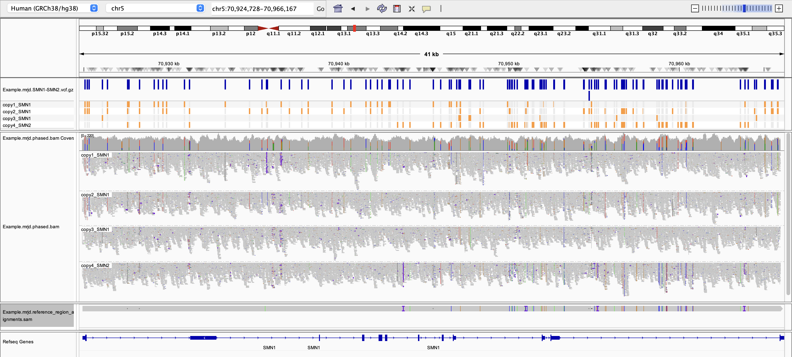

定相 BAM 文件显示分配给每个拷贝的 reads。在 IGV 中，可以通过加载 BAM 文件并按 phase 分组联配来进行可视化。

参考区域联配 SAM 文件突出显示了 *SMN1* 和 *SMN2* 参考区域之间的序列差异，为解读拷贝特异的变异分配提供了背景信息。

### 在 DRAGEN 报告中可视化 MRJD 结果

MRJD 结果被整合到 DRAGEN 报告中。对于样本级报告，MRJD 结果可在 **Paralogs** 标签页下查看。

**Paralog Sets** 表格提供每个已分析旁系同源区域的概览，包括估算的总拷贝数。选择某个区域会打开 **Paralogous regions** 视图，显示每个旁系同源区域内的单倍型解析变异检测结果。

下图展示了 **PMS2–PMS2CL** 的 MRJD 定相变异检测示例。在该可视化中，深橙色表示旁系同源区域之间参考差异位点上的替代等位基因，浅橙色表示参考差异位点上的参考等位基因，灰色表示非参考差异位点的变异。

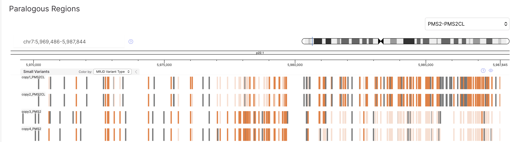

### 注意事项

- 仅当估算的总拷贝数小于 8 时，MRJD 才支持旁系同源区域检测。拷贝数更高的区域会被跳过，不进行变异检测；但总拷贝数估算仍会在 JSON 输出中报告。
- MRJD 仅支持 hg38 参考基因组。
- 仅当样本平均连接覆盖度（不含重复）≥16× 时才支持变异检测。
- MRJD 目前仅支持小变异检测。

## STR 检测

TruPath 数据通过利用邻近连接信息将重复的 read 对（包括重复区内 reads，IRRs）定位到其正确的基因组位置，改进了长短串联重复（STR）的比对准确度。这使得 STR 扩张的大小评估更准确，特别是对于超过片段长度的大重复。

DRAGEN 还利用定相信息改进 STR 基因分型准确度，这对于大的杂合扩张尤为重要。当 IRR 回收、邻近连接和定相感知基因分型相结合时，运行 DRAGEN Germline 流程时会自动应用对 STR 检测的改进。

对于受支持的参考基因组，所有必需的资源文件都会被自动检测到。

### 重复区内 reads（IRR）回收

IRR 回收支持长度为 2 到 6 个碱基的重复基序。此范围之外的基序不会被 IRR 回收评估，即使它们存在于目录（catalog）中。

DRAGEN 使用邻近信息回收原本会保持未比对或错误比对的重复区内 reads（IRRs）。这一能力对于检测超过片段长度的大重复扩张尤为重要。虽然比对器会考虑邻近信息来改进联配，但 IRR 由于其低复杂度序列内容需要额外处理。

当 DRAGEN 以邻近模式运行时，IRR 回收默认启用。DRAGEN-STR 会相应自动调整其参数，在分析重复扩张样本时不建议禁用 IRR 回收。

IRR 回收依赖于一个定义候选 STR 区域及其相关重复基序的 BED 目录。目录可能包含同一基因组区域的多个条目，允许为单个 STR 位点指定不同的基序。

例如，*RFC1* 位点在目录中可以如下表示：

| 染色体 | 起始 | 结束 | 序列 | 名称 |
| --- | --- | --- | --- | --- |
| 4 | 39348424 | 39348479 | AAAAG | RFC1 |
| 4 | 39348424 | 39348479 | AAAGG | RFC1 |
| 4 | 39348424 | 39348479 | AAGGG | RFC1 |
| 4 | 39348424 | 39348479 | AAGAG | RFC1 |
| 4 | 39348424 | 39348479 | AACGG | RFC1 |
| 4 | 39348424 | 39348479 | ACGGG | RFC1 |
| 4 | 39348424 | 39348479 | ACAGG | RFC1 |
| 4 | 39348424 | 39348479 | AAAGGG | RFC1 |

DRAGEN 提供了用于 IRR 回收的 BED 目录，覆盖默认 DRAGEN-STR 目录的所有位点。默认 BED 目录位于 `<INSTALL_PATH>/resources/irr_recovery/` 目录中。

当使用受支持的参考基因组和默认目录时，IRR 回收会自动启用，无需额外的命令行参数。

#### 自定义目录

DRAGEN 通过 `--irr-recovery-str-bed` 命令行选项支持用于重复区内 reads（IRR）回收的自定义 BED 目录。自定义目录必须遵循 DRAGEN 提供的默认目录的相同格式。

当提供自定义目录时，DRAGEN 会使用它替代所选参考基因组的默认目录。务必确保自定义目录包含所有用于重复扩张检测的感兴趣位点。如果目录中缺少某个位点，则不会对该位点执行 IRR 回收，这可能会降低灵敏度。

DRAGEN 提供的内置目录可从 [DRAGEN Product Files Site](https://support.illumina.com/sequencing/sequencing_software/dragen-bio-it-platform/product_files.html) 下载，可作为生成自定义目录的起点。

#### IRR 回收 BAM 标签

重新定位的 IRR 在输出 BAM 文件中使用 `tr` 标签标注。`tr` 标签以 16 位打包表示形式编码重复基序和基序长度：

- 低 12 位使用 2 位编码 `[A=00, C=01, G=10, T=11]` 编码基序碱基
- 高 4 位编码基序长度
- 碱基从最低有效位到最高有效位排列

例如，长度为 5 的基序 *AAGGG* 相应地在打包的 `tr` 表示中编码。

为了避免冗余的基序表示，打包形式始终对应最短的基序模式，并且是在正向基序及其反向互补之间按字典序最小的旋转。例如，基序 *CACA* 表示为 *AC*。

`tr` 标签应用于所有使用邻近信息回收的 IRR。重新定位的 IRR 被分配一个单一的联配位置，对应于参考基因组中相关 STR 区域的第一个碱基，并以 MAPQ 0 标记为未比对。

### 定相

当启用邻近模式时，DRAGEN 利用可用的定相信息改进重复扩张基因分型的准确度。定相有助于解决二倍体区域中 reads 分配到单倍型的歧义，这对于准确评估大的杂合扩张中的重复大小尤为重要。

输出的检测结果保持未定相状态，并使用标准的短串联重复（STR）变异 VCF 格式报告。然而，底层的基因分型模型纳入了定相信息以改进重复大小估算。

### 测序效率校正

某些位点受到测序偏倚的影响，导致等位基因间的覆盖度不均匀。这些偏倚会降低重复扩张基因分型的准确度。

当启用邻近模式时，DRAGEN 应用测序效率校正，根据经验数据调整每个位点的预期覆盖度。该校正通过补偿系统性测序偏倚改进重复大小估算。为了最小化来自比对偏倚的混淆效应，测序效率校正仅对 TruPath 样本启用。

测序效率校正可以通过向相应目录条目添加 `SequencingEfficiencyCorrection` 字段，按位点应用。例如：

```yaml
{
     "LocusId": "DMPK",
     "LocusStructure": "(CAG)*",
     "ReferenceRegion": "chr4:3076600-3076625",
     "VariantType": "Repeat",
     "SequencingEfficiencyCorrection": 1.2345 # 示例校正因子
}
```

校正因子应基于一组通过正交方法已知重复大小的对照样本，以经验方式确定。DRAGEN 在默认目录中提供了针对以下位点校准的预计算校正因子：

- *FMR1*
- *DMPK*
- *FXN*

## 协同定位图谱（Colocation Maps）

协同定位图谱捕获邻近信息，用于表征样本内的长距离互作。协同定位模块的输出是一个互作计数矩阵，其中每个单元代表两个基因组区域之间观察到的互作次数。

协同定位图谱通常可视化为热图。下图示例展示了 5 号染色体上的一个小区域。较暗的像素表示相应基因组区域之间更多的互作次数。

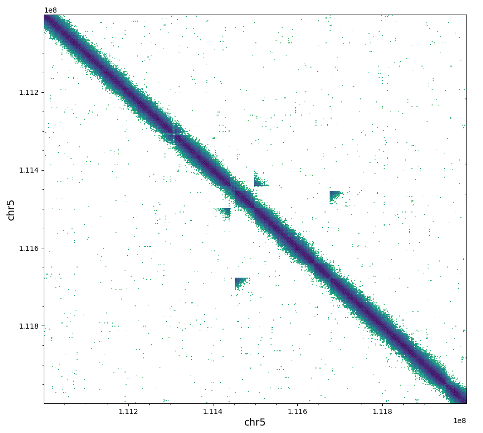

在协同定位热图中可以观察到几个常见特征：

- 主对角线反映了来源于同一条长模板分子并落在邻近基因组 bin 中的片段之间的互作。
- 三角形或非对角结构可能指示结构变异，如大缺失或断点。
- 大多数非对角像素要么为空（白色），要么代表低水平背景信号（绿色）。

### 协同定位图谱生成

协同定位图谱的生成是一个三步过程：

- 收集相关联配
- 计算协同定位矩阵
- 生成输出文件

#### 联配收集

在联配收集期间，DRAGEN 收集所有符合条件的 reads 进行分析。如果联配比对到 decoy contigs、低于比对质量阈值或标记为重复，则会被排除。剩余的 reads 被分配到基因组 bin，每个 bin 代表基因组约 2,000 bp。

#### 矩阵构建

然后通过评估 reads 之间的空间关系构建协同定位矩阵。对于每条 read（`read1`），DRAGEN 识别附近的 reads（`read2`），并递增其各自 bin 对应的矩阵条目。如果 read 落在以 `read1` 为中心的矩形区域内，则认为该 read 邻近。该区域的大小由样本的邻近连接特征决定，选择时需兼顾灵敏度和性能。

#### 附加选项

有几个选项可用于控制协同定位矩阵的生成：

- 基因组被划分为固定长度的等长 bin，联配根据其起始位置分配到 bin。可以使用 `--colocation-bin-size` 选项调整 bin 大小。
- 可以使用 `--colocation-alignment-filter-flags` 排除具有特定 BAM 标志的联配，该选项接受一个指定要忽略的标志的整数位掩码。
- 可以使用 `--colocation-alignment-min-mapq` 强制设定最小比对质量。

### Cooler 文件

协同定位输出被写入一个 cooler 文件，包含协同定位矩阵的稀疏表示。

该文件符合[官方 cooler 规范](https://cooler.readthedocs.io/en/latest/schema.html)的 schema 3。DRAGEN 生成单分辨率的 cooler 文件。协同定位矩阵以方形模式存储且对称，每个像素包含一个类型为 `int32` 的单一整数 `count` 字段。

生成的 cooler 文件可以使用 cooler CLI 或 Python API 进行处理。

### 协同定位过滤

协同定位过滤使用协同定位图谱数据评估结构变异（SV）断点的邻近支持，并标记缺乏邻近证据支持的事件。

对于由坐标 `chrom1:pos1` 和 `chrom2:pos2` 定义的每个候选断点，过滤器评估协同定位图谱的局部区域。以这些坐标为中心的边界框被应用，默认大小为 200 kb，该区域内所有 bin 的值被求和以量化局部互作支持。

为了考虑测序深度和数据质量的变化，区域总和使用协同定位图谱的非零对角线值中位数进行归一化。如果归一化值低于配置的阈值（默认值：1.0），则在 VCF 输出中对断点应用 `ColocationSum` 过滤。

过滤的应用遵循成对事件语义：

- 如果 `ColocationSum` 过滤应用于成对 SV 事件的一个断点，则也会应用于对应的 mate 断点记录。

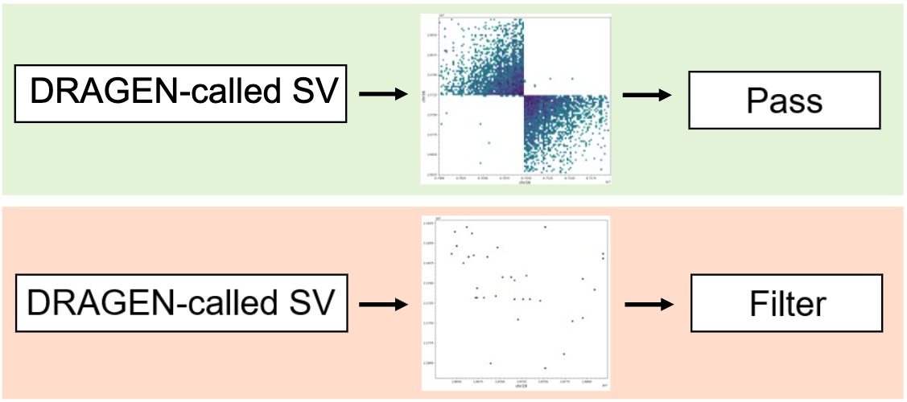

#### 使用协同定位过滤运行 DRAGEN SV

如果 `enable-colocation` 和 `enable-sv` 均设置为 `true`，则协同定位过滤默认启用。要在启用 TruPath 时手动禁用过滤，可在启动 DRAGEN 分析时将 `--sv-enable-colocation-filter` 设置为 `false`。

附加选项：

- `sv-colocation-filter-normalize-by-median`：如果为 true，协同定位过滤将通过协同定位矩阵的对角线值中位数归一化区域总和（默认值：true）
- `sv-colocation-filter-threshold`：通过过滤所需的协同定位矩阵中区域的最小（归一化）总和（默认值：1.0）
- `sv-colocation-filter-region-width`：协同定位矩阵中计算总和的方形区域宽度（bp）（默认值：200 kbp）
- `sv-colocation-filter-min-svlen`：如果为 true，协同定位过滤不会对彼此距离在此范围内的染色体内断点对运行（默认值：200 kbp）
- `sv-colocation-filter-inter-bnd`：如果为 true，协同定位过滤将应用于染色体间断点（默认值：true）
- `sv-colocation-filter-intra-bnd`：如果为 true，协同定位过滤将应用于染色体内断点（默认值：true）

#### 输出

如果启用协同定位过滤，SV VCF 文件将包含额外的头信息：

```
##INFO=<ID=NORMALIZED_COLOC_SUM,Number=1,Type=Float,Description="The sum of the square region in the colocation matrix centered on variant coordinates with width 200000 and normalized by the median diagonal count">
##FILTER=<ID=ColocationSum,Description="The sum of the square region in the colocation matrix centered on variant coordinates with width 200000 and normalized by the median diagonal count does not meet the threshold of 1">
```

下面可以看到 VCF 记录示例。第一个断点对应用了 `ColocationSum` 过滤，因为没有协同定位信号（`NORMALIZED_COLOC_SUM=0.0000`）。

```
chr1    94900000        DRAGEN:BND:12587:0:1:0:0:0:0    A       A[chr2:39900000[       280     ColocationSum   SVTYPE=BND;MATEID=DRAGEN:BND:12587:0:1:0:0:0:1;BND_DEPTH=52;MATE_BND_DEPTH=54;NORMALIZED_COLOC_SUM=0.0000  GT:GQ:PL:PR:MLQS:VF:VF1:VAF1:VF2:VAF2   0/1:280:330,0,637:38,3:.:38,3:23,3:0.115385:15,3:0.166667
chr2   39900000        DRAGEN:BND:12587:0:1:0:0:0:1    C       ]chr1:94900000]C        280     ColocationSum   SVTYPE=BND;MATEID=DRAGEN:BND:12587:0:1:0:0:0:0;BND_DEPTH=54;MATE_BND_DEPTH=52;NORMALIZED_COLOC_SUM=0.0000      GT:GQ:PL:PR:MLQS:VF:VF1:VAF1:VF2:VAF2   0/1:280:330,0,637:38,3:.:38,3:15,3:0.166667:23,3:0.115385
chr3    52000000        DRAGEN:BND:65926:0:1:0:0:0:1    C       C]chr3:72000000]        955     PASS    SVTYPE=BND;MATEID=DRAGEN:BND:65926:0:1:0:0:0:0;BND_DEPTH=53;MATE_BND_DEPTH=54;NORMALIZED_COLOC_SUM=40.1980       GT:GQ:PL:PR:SR:SB:FS:MLQS:VF:VF1:VAF1:VF2:VAF2  0/1:715:999,0,712:29,8:38,23:21,17,1,22:44.774:.:48,31:21,19:0.475000:27,20:0.425532
chr3    72000000        DRAGEN:BND:65926:0:1:0:0:0:0    A       A]chr3:52000000]        955     PASS    SVTYPE=BND;MATEID=DRAGEN:BND:65926:0:1:0:0:0:1;BND_DEPTH=54;MATE_BND_DEPTH=53;NORMALIZED_COLOC_SUM=40.1980       GT:GQ:PL:PR:SR:SB:FS:MLQS:VF:VF1:VAF1:VF2:VAF2  0/1:715:999,0,712:29,8:38,23:21,17,1,22:44.774:.:48,31:27,20:0.425532:21,19:0.475000
```

## 从 TruPath 数据进行的靶向检测

对于 WGS TruPath 数据，启用靶向检测器（Targeted Caller）时仅会运行 `lpa`、`hba` 和 `smn`。可以通过命令行启用自定义的受支持靶标列表。

## 邻近覆盖度报告

当启用邻近比对时，DRAGEN 会生成一组并行的覆盖度报告，过滤为仅包含连接的 reads。

在模板重建期间，每个 read 对片段被分配一个连接质量得分，等于将其连接到其他片段的最高质量连接。只有连接质量得分达到或超过指定阈值的片段中的 reads 才包含在邻近覆盖度报告中。

邻近覆盖度报告针对使用 `--proximity-min-linkq-threshold`（默认值：10）和 `--proximity-additional-linkq-thresholds`（默认值：25；最多两个值）指定的每个连接质量阈值生成。这些报告适用于 WGS 和所有已定义的 QC 覆盖区域。

| 报告名称 | 输出文件 | 说明 |
| --- | --- | --- |
| 邻近覆盖度指标 | _proximity_linkqual\<linkq-threshold>_coverage_metrics.csv | 连接 reads 的覆盖度统计 |
| 邻近精细直方图覆盖度 | _proximity_linkqual\<linkq-threshold>_fine_hist.csv | 连接 reads 的详细覆盖度直方图 |
| 邻近直方图覆盖度 | _proximity_linkqual\<linkq-threshold>_hist.csv | 连接 reads 的分箱覆盖度直方图 |
| 邻近总体平均覆盖度 | _proximity_linkqual\<linkq-threshold>_overall_mean_cov.csv | 连接 reads 的总体平均覆盖度 |
| 邻近每条 contig 平均覆盖度 | _proximity_linkqual\<linkq-threshold>_contig_mean_cov.csv | 连接 reads 的每条 contig 平均覆盖度 |

这些报告使用与标准覆盖度报告相同的格式和指标，但反映的是仅从达到指定阈值的连接 reads 计算得到的统计信息。

## 报告

DRAGEN-Reports 包含一个 TruPath 专属的清单文件，用于为 TruPath WGS 分析生成报告。清单文件 `trupath/germline_wgs.json` 位于 /opt/dragen-reports/manifests 目录。除了 DRAGEN WGS 报告提供的标准 QC 指标和可视化外，TruPath 报告还包含一个额外的 `Proximity` 标签页，突出显示 TruPath 邻近启用分析特有的指标和可视化，包括：

- `Model Fit` – 均方根误差，指示邻近模型拟合数据的程度。
- `Q25 Proximity Rate` – 至少有一个高于 Q25 的邻居的 read 对百分比。
- `Q25 Proximity Coverage` – 连接质量高于 Q25 的 read 对的平均常染色体覆盖度。
- `P75 Template Size` – 第 75 百分位的连接模板分子大小。
- `Phase Block NG50` – 覆盖至少 50% 基因组所需的最小定相区块大小。

`Proximity` 标签页还包括几个汇总邻近特异性特征的的可视化，包括：

来自 `<prefix>.wgs_template_gdist.csv` 的模板基因组长度分布

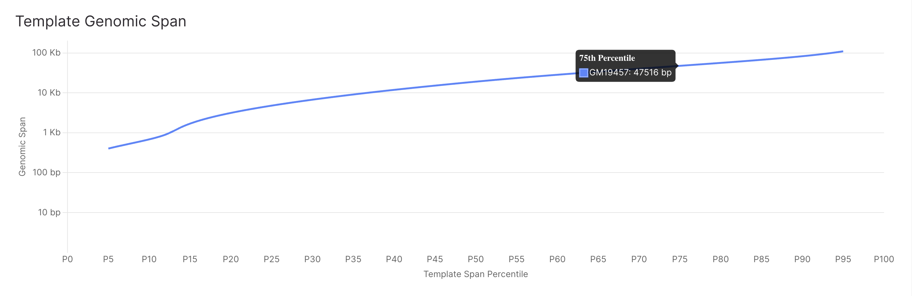

按最小区块大小划分的变异定相区块的基因组覆盖度，来自 `<prefix>.phase_blocks.gtf`

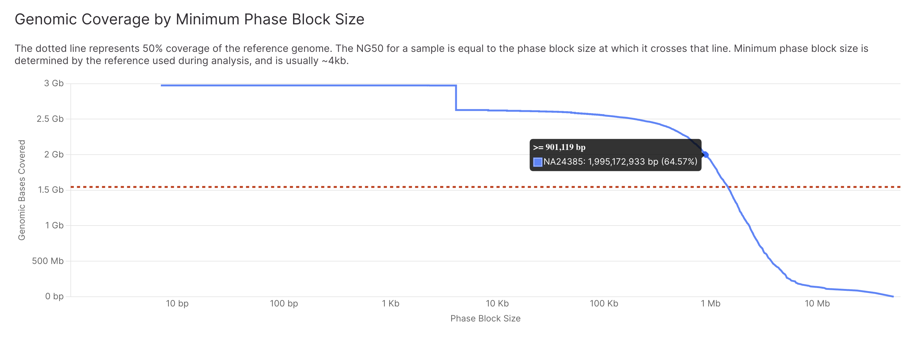

按子读段计数划分的模板分布，来自 `<prefix>.<qc-region>_template_gdist.csv`

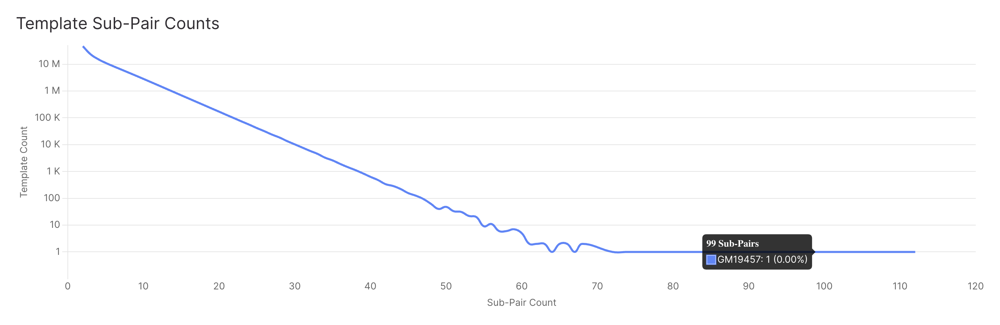

## 局限性

Illumina TruPath 邻近启用分析具有以下局限性：

- Illumina TruPath 邻近模式目前仅支持 DRAGEN Germline 流程。Somatic（体细胞）、RNA、UMI、MRD 和 Methylation（甲基化）流程不受支持。
- 不支持 DRAGEN 降采样（downsampling）。为了保持 TruPath 检测的邻近特性，不应随机降采样 FASTQ。
- 仅验证了使用 hg38 的人类样本。
- 目前仅支持来自 Illumina TruPath Genome 建库的 TruPath 数据输入。对非 TruPath 数据输入运行 `--enable-proximity=true` 将中止分析。
- 定相需要使用启用个性化的泛基因组（pangenome）参考哈希表。低覆盖度时分析将停止以支持个性化。
- 对于本地（on-premises）分析，由于 FPGA 内存限制，TruPath 分析需要 v4 DRAGEN 服务器。作为参考，v4 服务器的序列号以字母 "AC" 开头。
- 对于云分析，TruPath 分析必须在 AWS f2 实例类型上运行。Azure NP 系列和 GCP FPGA 平台目前不受支持。
- MRJD 需要至少 16× 覆盖度才能进行检测；对于比对 read 覆盖度不足的基因，检测器将中止任何检测尝试。

## TruPath Genome 许可

Illumina TruPath 邻近启用分析可以在云上或受支持的本地系统上运行。

- 云分析通过 Illumina Connected Analytics (ICA)、BaseSpace Sequence Hub (BSSH) Run Planning with AutoLaunch，以及在 AWS EC2 f2.6xlarge 实例上的 DRAGEN FPGA Cloud BYOL 支持。
- 本地分析在 Phase 4 DRAGEN On-Prem 服务器上受支持。
- 对于 DRAGEN On-Prem 服务器和 DRAGEN FPGA Cloud BYOL 客户，该流程需要 Proximity 许可证。
- Proximity 许可证随 Illumina TruPath Genome 建库试剂盒购买时附带，并自动分配。
- 由于 FPGA 内存限制，用于本地使用的 Proximity 许可证仅在 Phase 4 服务器上受支持。Phase 4 服务器可通过序列号以字母 "AC" 开头来识别。

---

## 术语表

| 英文术语 | 中文翻译 |
| --- | --- |
| proximity | 邻近（性） |
| flowcell | 流动槽 |
| template | 模板（分子） |
| fragment / subpair | 片段 / 子对 |
| phasing / phase block | 定相 / 定相区块 |
| haplotype | 单倍型 |
| paralog | 旁系同源（基因） |
| colocation | 协同定位 |
| breakend (BND) | 断点 |
| read mapping / alignment | read 比对 / 联配 |
| variant calling | 变异检测 |
| genotyping | 基因分型 |
| linkage probability | 连接概率 |
| in-repeat reads (IRR) | 重复区内 reads |
| short tandem repeat (STR) | 短串联重复 |
| copy number | 拷贝数 |
| germline | 胚系（生殖系） |
